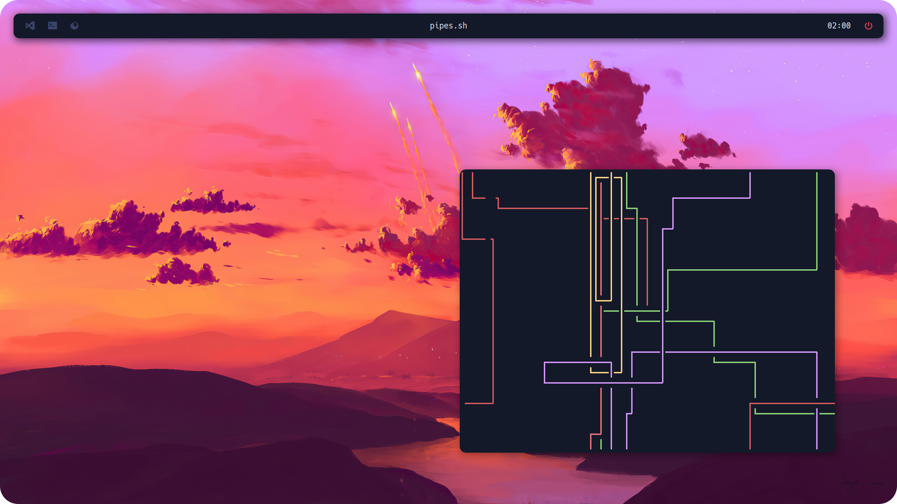

# i3 Dotfiles
 
Welcome to my **i3 dotfiles** repository! This repository contains my personal configuration files for the i3 window manager on Linux. It’s designed to provide a clean, efficient, and visually appealing desktop environment.


## Table of Contents
- [Features](#features)
- [Installation](#installation)
- [Dependencies](#Dependencies)
- [Screenshots](#Screenshots)

## Screenshots



## Features

- Lightweight and responsive window management
- Custom keybindings for quick navigation
- Aesthetic design with a focus on usability


## Dependencies

**Arch Linux 🔷**

To install the necessary dependencies on Arch Linux, run:

```sudo pacman -S neofetch kitty polybar picom i3```

**Debian ❣️ - (Ubuntu 🍊 - Mint 🍏)**

For Debian-based distributions, use the following command:


```sudo apt install neofetch kitty picom i3```

**Gentoo 🧼**

On Gentoo, you can install the required packages using:


```sudo emerge app-misc/neofetch x11-terminfo/kitty x11-wm/i3 x11-misc/picom```


**OpenSUSE 🦎**

For OpenSUSE distribution, use the following command:


```sudo zypper install neofetch kitty polybar picom i3```


## Installation

To get started with my i3 configuration, follow these steps:

1. Clone the repository:
   ```bash
   git clone https://github.com/user7210unix/i3-rounded-dotfiles.git
   cd i3-rounded-dotfiles
